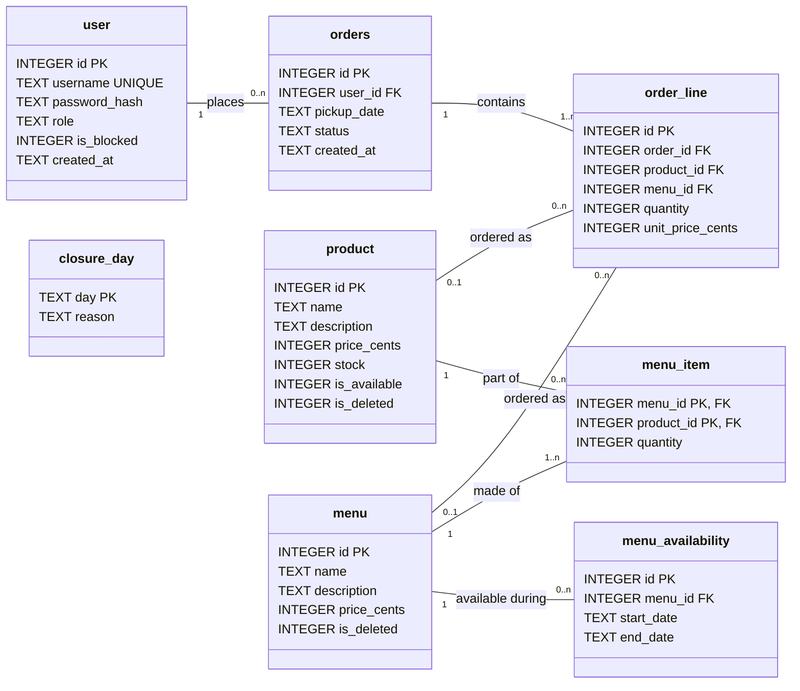

```mermaid
classDiagram
    direction LR

    class user {
        INTEGER id PK
        TEXT username UNIQUE
        TEXT password_hash
        TEXT role
        INTEGER is_blocked
        TEXT created_at
    }
    class orders {
        INTEGER id PK
        INTEGER user_id FK
        TEXT pickup_date
        TEXT status
        TEXT created_at
    }
    class order_line {
        INTEGER id PK
        INTEGER order_id FK
        INTEGER product_id FK
        INTEGER menu_id FK
        INTEGER quantity
        INTEGER unit_price_cents
    }
    class product {
        INTEGER id PK
        TEXT name
        TEXT description
        INTEGER price_cents
        INTEGER stock
        INTEGER is_available
        INTEGER is_deleted
    }
    class menu {
        INTEGER id PK
        TEXT name
        TEXT description
        INTEGER price_cents
        INTEGER is_deleted
    }
    class menu_item {
        INTEGER menu_id PK, FK
        INTEGER product_id PK, FK
        INTEGER quantity
    }
    class menu_availability {
        INTEGER id PK
        INTEGER menu_id FK
        TEXT start_date
        TEXT end_date
    }
    class closure_day {
        TEXT day PK
        TEXT reason
    }

    user "1" -- "0..n" orders : places
    orders "1" -- "1..n" order_line : contains
    product "0..1" -- "0..n" order_line : ordered as
    menu "0..1" -- "0..n" order_line : ordered as
    menu "1" -- "1..n" menu_item : made of
    product "1" -- "0..n" menu_item : part of
    menu "1" -- "0..n" menu_availability : available during
```
